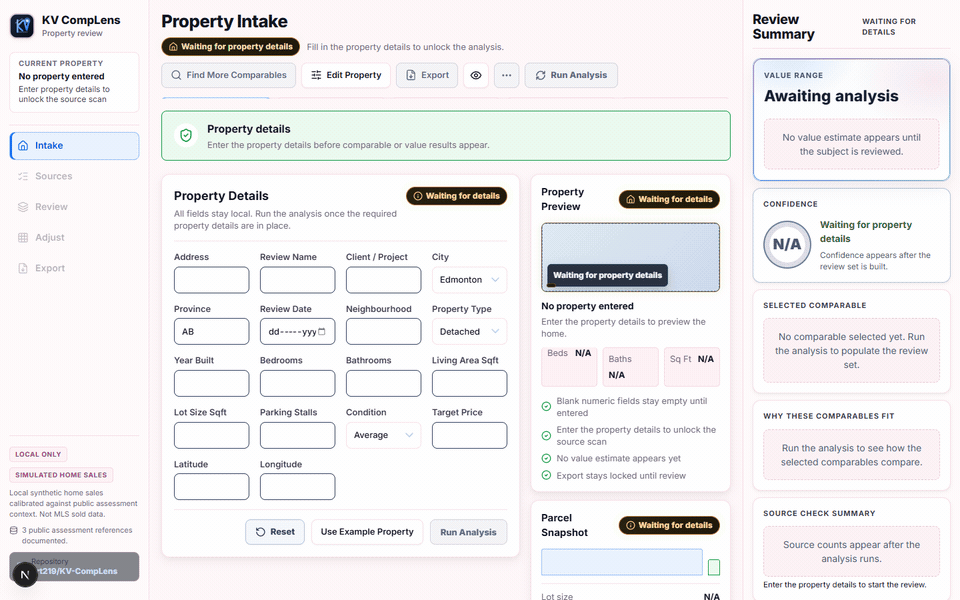
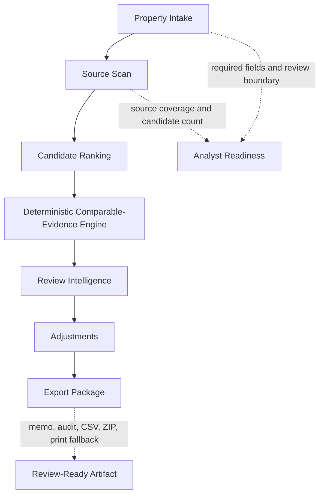
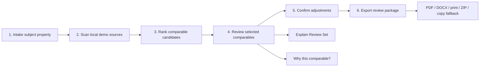
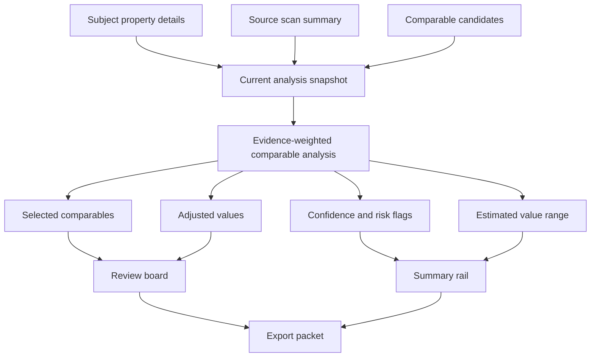
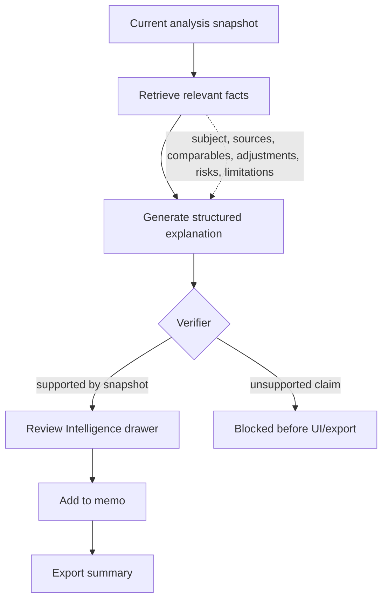
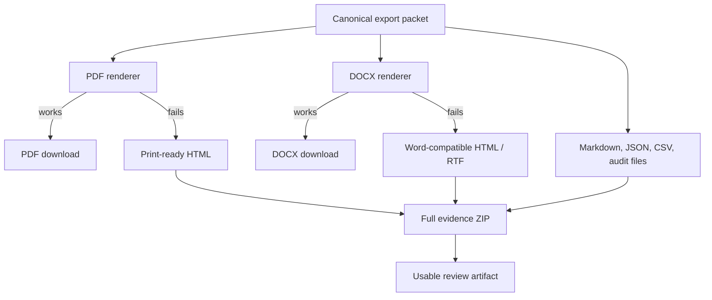
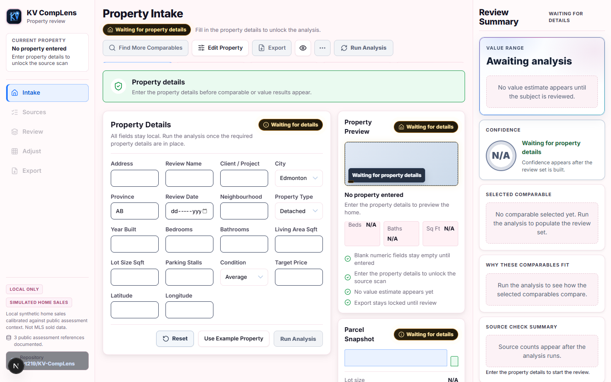
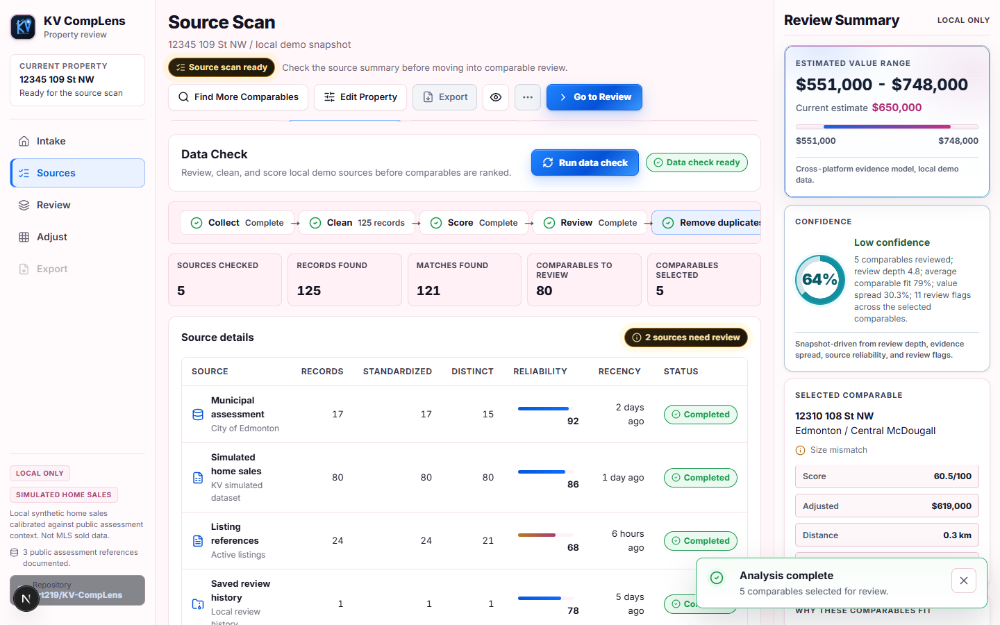
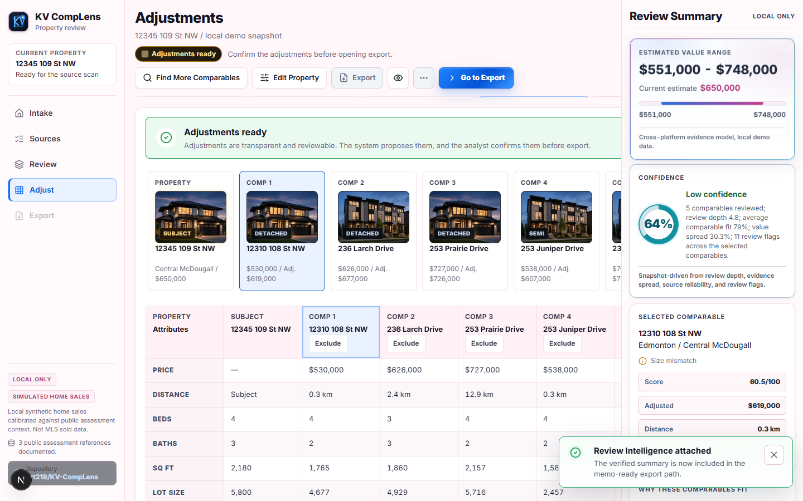

# KV CompLens


KV CompLens is not a valuation chatbot. It is a deterministic comparable-evidence workflow that helps an analyst build, review, explain, and export a residential comp-analysis packet.

KV CompLens is an underwriting-support workflow for residential comparable-sales analysis. Instead of asking AI to determine property value, the platform treats comparable properties as evidence. A deterministic comparable-evidence engine ranks, adjusts, and reconciles comparable sales, while Review Intelligence converts verified evidence into analyst-readable summaries, export packages, and audit-friendly outputs.

- Public app: [kv-complens.vercel.app](https://kv-complens.vercel.app)
- Demo mode: [kv-complens.vercel.app/?demo=1](https://kv-complens.vercel.app/?demo=1)
- Video walkthrough: [YouTube demo](https://youtu.be/gXPEFDbuXZg)
- Repository: [zrt219/KV-CompLens](https://github.com/zrt219/KV-CompLens)
- Build log: [ai-engineering/hackathon/kv-complens-build-log.md](ai-engineering/hackathon/kv-complens-build-log.md)
- Source of truth: [ai-engineering/source-of-truth.md](ai-engineering/source-of-truth.md)

[](https://youtu.be/gXPEFDbuXZg)

Workflow preview: intake, source scan, review comparables, adjustments, and export package.



## Problem

Comp analysis is one of the most manual steps in residential underwriting.

Analysts must:

- find comparable properties
- assess source quality
- adjust values
- estimate ranges
- document rationale
- prepare review-ready outputs

This process is slow, inconsistent, and difficult to audit.

## Solution

KV CompLens turns comparable-sales review into a deterministic evidence workflow.

The platform guides the analyst from intake through export, keeping the reasoning legible at each step and preserving clear review boundaries. It is not a real-estate chatbot, not a live MLS product, not an appraisal engine, and not a credit-decision system.

## Why This Matters

The challenge is not producing a value.

The challenge is producing a value that an analyst can review, explain, challenge, and export.

KV CompLens focuses on workflow quality, evidence traceability, and reviewer trust rather than black-box valuation.

## Architecture Diagram



## Workflow Diagrams

### 1. Analyst Workflow



### 2. Evidence-To-Estimate Flow



### 3. Review Intelligence Grounding



### 4. Export Resilience



## Why KV CompLens Is Different

Most prototypes stop at property matching.

KV CompLens treats comparable sales as evidence.

The platform:

- ranks comparable evidence instead of guessing a value from free-form text
- computes adjusted value support with deterministic logic
- identifies stronger and weaker comparables
- supports analyst review before export
- produces export-ready outputs with fallback paths
- records audit-oriented review events

The system does not ask an LLM what a property is worth.

The deterministic analysis engine computes the evidence. Review Intelligence explains verified evidence.

## Review Intelligence

Review Intelligence is the strongest differentiator in the product.

It is:

- verifier-gated
- grounded in the current deterministic snapshot
- able to identify strongest and weakest comparables
- available through `Explain Review Set` and `Why this comparable?`
- attachable to memo and export output
- designed to expose public reasoning artifacts without exposing chain-of-thought

It does not:

- determine value
- claim live MLS access
- claim appraisal authority
- claim credit-decision authority
- replace analyst review

Every explanation is grounded in the current analysis snapshot.

## Screenshots

### Video Walkthrough

Watch the full reviewer flow from demo mode through export: [YouTube demo](https://youtu.be/gXPEFDbuXZg).

[](https://youtu.be/gXPEFDbuXZg)

### Property Intake

The workflow starts with a clean intake surface that frames readiness, required fields, and the review boundary before any analysis runs.



### Source Scan

The source scan summarizes evidence quality, record coverage, and candidate readiness before the analyst moves into comparable review.



### Review Comparables

The Evidence Board centers the subject property, selected comparables, and reviewer-facing reasoning instead of hiding the workflow inside a black-box model.


### Comparable Impact Preview

Before a new comparable is added, KV CompLens previews the expected impact on the review packet so the analyst can decide whether the candidate improves the evidence set or adds unnecessary risk.


### Adjustments

The adjustments step makes the review logic explicit through line-level changes and visible range impact.



### Export Package

The export surface converts the current review set into resilient report artifacts with PDF, DOCX, print, ZIP, JSON, CSV, and copyable fallback paths.


### PDF Report

The PDF report packages the current review snapshot into a clean, shareable underwriting-support document with subject details, selected comparables, adjustment logic, value range, confidence indicators, limitations, and audit-ready review notes.


### Export Artifacts

Export artifacts are generated from the same canonical packet: PDF, DOCX, print-ready HTML, Word-compatible fallback, Markdown, JSON, CSV, ZIP, and copyable report text.

### Print-Ready Report

The print-ready viewer turns the same export packet into a clean browser document that can be opened directly or saved as PDF when primary export formats fail.


## Workflow

Video walkthrough: [Watch KV CompLens on YouTube](https://youtu.be/gXPEFDbuXZg)

1. Intake the subject property and establish whether the review can run.
2. Scan and summarize local demo evidence sources.
3. Rank candidate comparables and review the selected set on the Evidence Board.
4. Apply deterministic adjustments and confirm the review set.
5. Generate export-ready artifacts with memo, audit, and Review Intelligence summary support.

## Technical Architecture

Core implementation surfaces:

- `src/app/page.tsx` drives the main underwriting workspace
- analysis state hooks manage reducer-backed UI state, workflow transitions, and demo hydration
- deterministic analysis modules produce the canonical review snapshot
- reviewer-facing explanation modules build and verify grounded Review Intelligence outputs
- `lib/export/*` generates packet-driven export artifacts and fallbacks
- `src/components/evidence-board/*` powers the comparable-review surface
- Review Intelligence drawer components power the explanation and memo attachment path
- `packages/core/*` contains the deterministic ranking, scoring, adjustment, valuation, and confidence logic
- `tests/*` and `packages/core/*.test.ts` cover UI state, export behavior, and deterministic model behavior

## Deterministic Comparable-Evidence Engine

The product uses a deterministic comparable-evidence engine as the analysis layer.

That layer is responsible for:

- ranking comparable candidates from structured inputs and source reliability
- selecting the review set
- applying deterministic adjustment logic
- estimating low, midpoint, and high value ranges
- computing confidence and risk flags
- producing the canonical snapshot that drives the UI, exports, and Review Intelligence

The LLM layer does not determine value. It explains verified deterministic evidence.

## Export Resilience Layer

KV CompLens uses a layered export strategy so the export page is not a dead end if one renderer fails.

1. Native PDF and DOCX generation from the canonical export packet.
2. Print-ready HTML and Word-compatible HTML or RTF fallbacks.
3. Full evidence ZIP containing HTML, Markdown, JSON, CSV, audit, and limitations files.
4. Copy-report fallback when browser downloads are blocked.

This makes the export story reviewer-safe: the user still gets a usable artifact even when a primary format fails.

## Audit And Provenance

The app preserves an audit-oriented state through:

- source-scan summaries
- selected and rejected comparable sets
- deterministic valuation outputs
- memo attachment events
- review-intelligence attachment state
- explicit demo-data and public-source boundaries
- export artifacts generated from the same canonical packet

Public-source references are methodology and context only. They are not presented as transaction-level sold-data provenance for the synthetic comparable set.

## Public Data References

Public assessment and municipal references used for context:

- [City of Edmonton Property Assessment Data](https://data.edmonton.ca/City-Administration/Property-Assessment-Data-Current-Calendar-Year-/q7d6-ambg)
- [City of Calgary Historical Property Assessments](https://data.calgary.ca/Government/Historical-Property-Assessments-Parcel-/4ur7-wsgc/data)
- [City of Calgary Residential Assessment Explanation](https://www.calgary.ca/PDA/Assessment/Pages/Residential-property-assessments.aspx?master=nav)

## How To Run

```bash
npm install
npm run dev
```

Then open the local URL reported by the Next.js dev server.

## How To Verify

```bash
npm run lint
npm test
npm run build
```

Latest verified in this pass:

- `npm run lint` passed
- `npm test` passed with `91` tests across `26` files
- `npm run build` passed

## Known Limitations

- Sale records are synthetic demo records
- No licensed MLS sold-data feed is ingested
- No live land-title, appraisal, or permit connector is active
- Adjustments are deterministic review heuristics, not appraisal-grade calibration
- No analyst authentication, team review workflow, or persistent storage
- No production credit-decision capability

## Future Work

Future iterations could include:

- licensed MLS integrations
- commercial borrower workflows
- portfolio-level risk analysis
- historical market trend modeling
- document extraction workflows
- reviewer collaboration and approval queues
- persistent review history

## Builder

Zhane Grey

Technical Lead Developer at UMATTR

Focus:

- AI Product Engineering
- Deterministic AI Systems
- RAG / Evaluation Workflows
- Full-Stack Applications
- Solidity / Web3 Infrastructure

Links:

- GitHub: [github.com/zrt219](https://github.com/zrt219)
- LinkedIn: [zhane-grey-987258395](https://www.linkedin.com/in/zhane-grey-987258395)
- Live demo: [kv-complens.vercel.app](https://kv-complens.vercel.app)
- Portfolio: [beacons.ai/zrt_219](https://beacons.ai/zrt_219)

Proof of work:

- documented Codex workflow archive with `1,331,817` live workflow events across `1010` session logs as of `2026-06-04`
- broader Codex usage footprint of `6.1B` lifetime tokens across long-horizon AI engineering workflows
